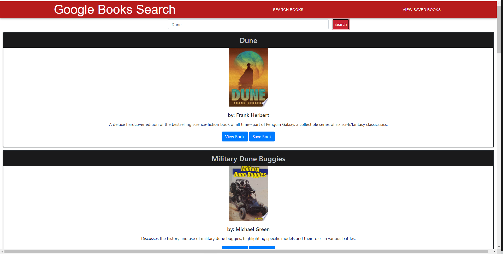
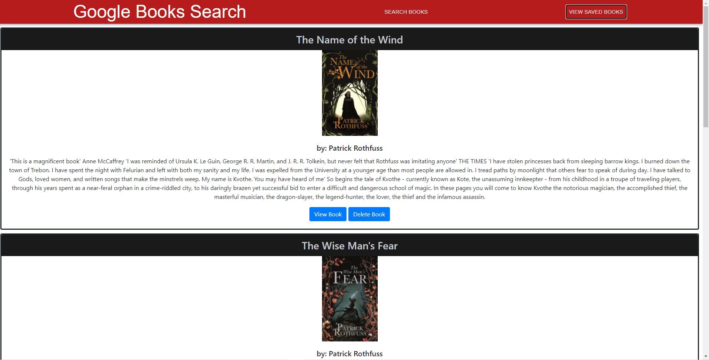

# React Google Books Search

[](https://opensource.org/licenses/MIT)

## Table of Contents
* [Description](#description)
* [Installation](#installation)
* [Usage](#usage)
* [Credits](#credits)
* [Contributing](#contributing)
* [License](#license)
* [URL](#url)
* [Questions](#questions)

## Description

This app built using react allows users to search for books using the google books api and save their favorite books to their saved books. In the saved books tab, users may delete books.

## Installation

### To use in VScode
1. Clone the github repository linked below to your local machine. 
2. Next, run npm install in the root folder to install any of the required dependencies.
3. Afterwards, cd into the client directory and run npm install again.
3. Then run npm start in your command line/terminal to view the webpage on you localhost. 
4. You may also use the link provided below to navigate directly to the deployed webpage.

## Usage





## Credits
```
This was created by Brad Williams to showcase his work and to connect with potential customers and employers.
```

## Contributing

Unlike my other work, pull request are permitted, but please refrain from making any changes to the code. If you have any questions or would like to collaborate, please reach out to me by any of the methods linked on this site. Additionally, my GitHub link and email are listed below.

## License

Copyright (c) [2020] [Brad Williams]

Permission is hereby granted, free of charge, to any person obtaining a copy of this software and associated documentation files (the "Software"), to deal in the Software without restriction, including without limitation the rights to use, copy, modify, merge, publish, distribute, sublicense, and/or sell copies of the Software, and to permit persons to whom the Software is furnished to do so, subject to the following conditions:

The above copyright notice and this permission notice shall be included in all copies or substantial portions of the Software.

THE SOFTWARE IS PROVIDED "AS IS", WITHOUT WARRANTY OF ANY KIND, EXPRESS OR IMPLIED, INCLUDING BUT NOT LIMITED TO THE WARRANTIES OF MERCHANTABILITY, FITNESS FOR A PARTICULAR PURPOSE AND NONINFRINGEMENT. IN NO EVENT SHALL THE AUTHORS OR COPYRIGHT HOLDERS BE LIABLE FOR ANY CLAIM, DAMAGES OR OTHER LIABILITY, WHETHER IN AN ACTION OF CONTRACT, TORT OR OTHERWISE, ARISING FROM, OUT OF OR IN CONNECTION WITH THE SOFTWARE OR THE USE OR OTHER DEALINGS IN THE SOFTWARE.

## URL

[Link to GitHub repository](https://github.com/bread-w/gt-react-google-books)

[Link to deployed webpage]()

## Questions

If you have any questions, follow my GitHub profile here: https://github.com/bread-w.

You can also email me at jb.wms89@gmail.com.
